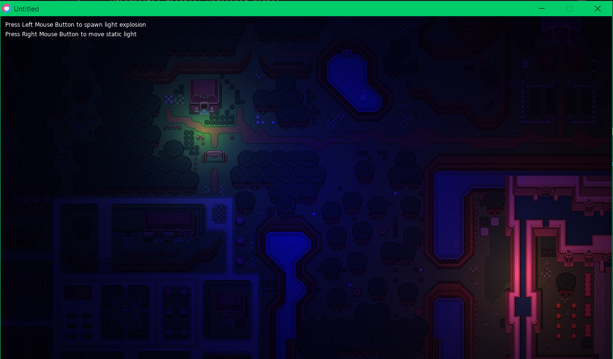
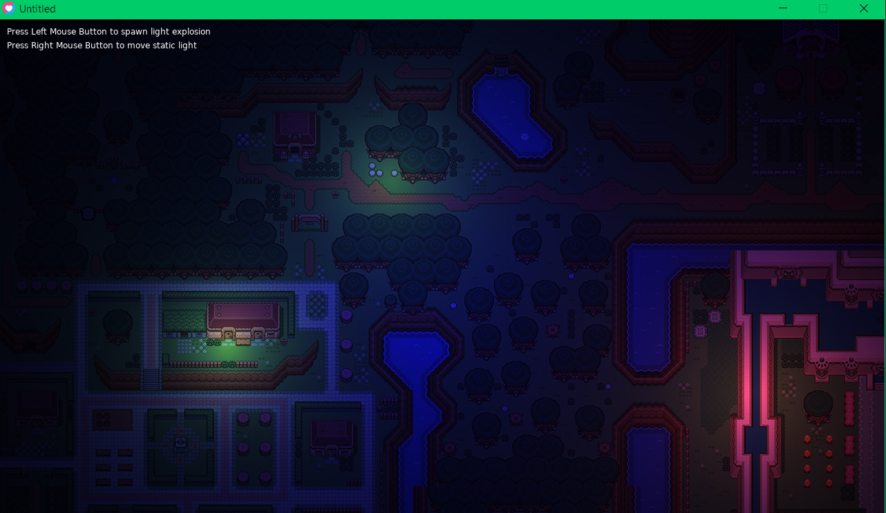

# Example of using light shader in Love2D

The example demonstrates how to add simple light to Love2D using phong shading.

## Currently there are

* Static lights (movable)
* Explosions imitation (use love.update())
* Flickering torch light

## Screenshots

## Based on

* The code: <https://github.com/SkyVault/Love2DTutorialSeries/tree/master/Shaders/Part2Final>
* And video: [Love2D Shader Tutorial](https://www.youtube.com/watch?v=BkxN2pwwRPM)
